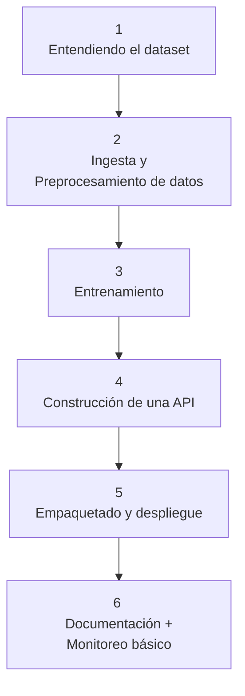

# Notas del proyecto

Las siguientes notas son mis apuntes personales del proyecto, las cuales me ayudaron a entender, organizar, estructurar y documentar mis ideas durante el desarrollo de este.

**Nombre del proyecto:** _Clasificador de niveles de estrés a partir de señales fisiológicas (Stress Level Classification API)_

**Categoría:** Salud y bienestar.

**Motivación:** Caso realista, alineado con mis intereses en bienestar, cognición, bioseñales y multimodalidad.

**Objetivo:** Desarrollar un sistema que clasifique el nivel de estrés de una persona (por ejemplo: bajo, medio, alto) a partir de señales fisiológicas (como frecuencia cardíaca, GSR, temperatura) usando un modelo de ML, que luego se despliegue como una **API REST** lista para producción.

**Dataset:** WESAD dataset (Wearable Stress and Affect Detection)

- **Decripción:** 
    WESAD contiene datos de 15 sujetos obtenidos durante un estudio de laboratorio sobre estrés y estados afectivos, mientras llevaban puestos sensores fisiológicos y de movimiento.

    Las modalidades de sensores incluidas son las siguientes: 
    - Pulso de volumen sanguíneo
    - Electrocardiograma
    - Actividad electrodérmica
    - Electromiograma 
    - Respiración
    - Temperatura corporal 
    - Aceleración en tres ejes

    Además, el conjunto de datos salva la distancia entre estudios de laboratorio previos sobre el estrés y las emociones, al incluir tres estados afectivos diferentes (neutral, estrés y diversión).

    Asimismo, en el conjunto de datos se incluyen los autoinformes de los sujetos, obtenidos mediante varios cuestionarios establecidos. 

- **Clases:** neutral, estrés, diversión

- **URL:** https://ubi29.informatik.uni-siegen.de/usi/data_wesad.html

- **Cita completa:** Philip Schmidt, Attila Reiss, Robert Duerichen, Claus Marberger and Kristof Van Laerhoven, "Introducing WESAD, a multimodal dataset for Wearable Stress and Affect Detection", ICMI 2018, Boulder, USA, 2018.

## Componentes del proyecto 



## 1. Entendiendo el dataset 

WESAD (Wearable Stress and Affect Detection) es un dataset multimodal para detectar estrés y estados afectivos a partir de datos fisiológicos recolectados con dispositivos portables.

- 17 sujetos participaron, pero solo 15 tienen datos útiles (S1 y S12 se descartan).
- Cada sujeto tiene su propia carpeta

Dentro de cada carpeta se encuentra:
| Archivo           | Contenido                                                               |
| ----------------- | ----------------------------------------------------------------------- |
| `SX_readme.txt`   | Info específica del sujeto (calidad de datos, notas)                    |
| `SX_quest.csv`    | Horario del protocolo + respuestas de cuestionarios                     |
| `SX_respiban.txt` | Datos crudos del dispositivo **de pecho (RespiBAN)**                    |
| `SX_E4_Data.zip`  | Datos crudos del dispositivo **de muñeca (Empatica E4)**                |
| `SX.pkl`          | Diccionario con **datos ya sincronizados + etiquetas** |

### ¿Qué contiene SX.pkl?

Es un diccionario con tres claves principales:

```python
{
  'subject': 'S2',
  'signal': {
      'chest': {...},   # RespiBAN: ACC, ECG, EDA, EMG, RESP, TEMP
      'wrist': {...}    # E4: ACC, BVP, EDA, TEMP
  },
  'label': array([...])  # Array sincronizado con etiquetas por muestra
}
```
### Labels 

| Valor | Estado                    |
| ----- | ------------------------- |
| 0     | Transitorio / sin definir |
| 1     | **Baseline (neutral)**        |
| 2     | **Estrés**                    |
| 3     | **Diversión (amusement)**     |
| 4     | Meditación                |
| 5–7   | Ignorar                   |

### Dispositivos usados y señales obtenidas 

**RespiBAN (pecho):**

- Alta frecuencia (700 Hz)
- Modalidades:
    - ECG (Electrocardiogram)
    - EDA (Electrodermal Activity)
    - EMG (Electromyogram)
    - RESP (Respiration)
    - TEMP (Body Temperature)
    - ACC (Accelerometer (3-axis))

**Empatica E4 (muñeca):**

Muestras a frecuencias distintas:
- ACC (32 Hz)
- BVP (Blood Volume Pulse 64 Hz)
- EDA y TEMP (4 Hz)

El resampleado uniformiza la tasa de datos, haciendo que todas las señales tengan el mismo número de muestras por segundo, facilitando su procesamiento. Ya está todo resampleado en el `.pkl` en este caso. 

### Cuestionarios (SX_quest.csv)

- Autoevaluaciones PANAS, STAI, SAM, SSSQ
- Horarios de cada condición (líneas 2–4)

La sincronización uniformiza la línea de tiempo, garantizando que todos los datos estén perfectamente alineados en el tiempo. Por ahora podemos no usar estos archivos, ya que las etiquetas del protocolo ya están sincronizadas en el `.pkl`


