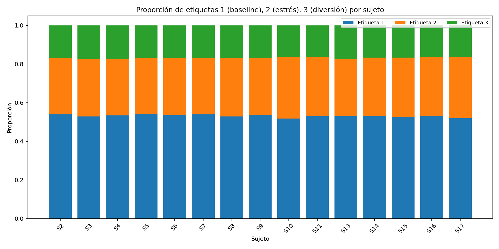

# Notas del proyecto

Las siguientes notas son mis apuntes personales del proyecto, las cuales me ayudaron a entender, organizar, estructurar y documentar mis ideas durante el desarrollo de este.

**Nombre del proyecto:** _Clasificador de estrés a partir de señales fisiológicas (Stress Classification)_

**Categoría:** Salud y bienestar.

**Motivación:** Caso realista, alineado con mis intereses en bienestar, cognición, bioseñales y multimodalidad.

**Objetivo:** Desarrollar un sistema de machine learning capaz de detectar si una persona se encuentra en un estado de estrés o no-estrés a partir de señales fisiológicas. Se buscará generalizar entre distintos sujetos y, en una primera versión, expondrá sus predicciones mediante una API REST mínima que reciba features procesadas y devuelva la probabilidad de estrés junto con la clase predicha.

**Dataset:** WESAD dataset (Wearable Stress and Affect Detection)

- **Decripción:** 
    WESAD contiene datos de 15 sujetos obtenidos durante un estudio de laboratorio sobre estrés y estados afectivos, mientras llevaban puestos sensores fisiológicos y de movimiento.

    Las modalidades de sensores incluidas son las siguientes: 
    - Pulso de volumen sanguíneo
    - Electrocardiograma
    - Actividad electrodérmica
    - Electromiograma 
    - Respiración
    - Temperatura corporal 
    - Aceleración en tres ejes

    Además, el conjunto de datos salva la distancia entre estudios de laboratorio previos sobre el estrés y las emociones, al incluir tres estados afectivos diferentes (neutral, estrés y diversión).

    Asimismo, en el conjunto de datos se incluyen los autoinformes de los sujetos, obtenidos mediante varios cuestionarios establecidos. 

- **Clases:** neutral, estrés, diversión

- **URL:** https://ubi29.informatik.uni-siegen.de/usi/data_wesad.html

- **Cita completa:** Philip Schmidt, Attila Reiss, Robert Duerichen, Claus Marberger and Kristof Van Laerhoven, "Introducing WESAD, a multimodal dataset for Wearable Stress and Affect Detection", ICMI 2018, Boulder, USA, 2018.

## Componentes generales del proyecto 

El proyecto se dividirá en etapas incrementales que permitan avanzar desde la exploración hacia un prototipo funcional:

- **Etapa 1.** Construcción de un modelo base con datos de un solo sujeto.

- **Etapa 2.** Generalización entre sujetos mediante validación LOSO.

- **Etapa 3.** Reencuadre del problema a una clasificación binaria (estrés vs no-estrés) y mejora de features.

- **Etapa 4.** Exposición del modelo a través de una API REST mínima que reciba features procesados y devuelva probabilidad de estrés + clase.


# Etapa 1. Construcción de un modelo base con datos de un solo sujeto

Construcción de un modelo sencillo que use los datos de un sólo sujeto. 
## Entendiendo el dataset 

WESAD (Wearable Stress and Affect Detection) es un dataset multimodal para detectar estrés y estados afectivos a partir de datos fisiológicos recolectados con dispositivos portables.

- 17 sujetos participaron, pero solo 15 tienen datos útiles (S1 y S12 se descartan).
- Cada sujeto tiene su propia carpeta

Dentro de cada carpeta se encuentra:
| Archivo           | Contenido                                                               |
| ----------------- | ----------------------------------------------------------------------- |
| `SX_readme.txt`   | Info específica del sujeto (calidad de datos, notas)                    |
| `SX_quest.csv`    | Horario del protocolo + respuestas de cuestionarios                     |
| `SX_respiban.txt` | Datos crudos del dispositivo **de pecho (RespiBAN)**                    |
| `SX_E4_Data.zip`  | Datos crudos del dispositivo **de muñeca (Empatica E4)**                |
| `SX.pkl`          | Diccionario con **datos ya sincronizados + etiquetas** |

### ¿Qué contiene SX.pkl?

Es un diccionario con tres claves principales:

```python
{
  'subject': 'S2',
  'signal': {
      'chest': {...},   # RespiBAN: ACC, ECG, EDA, EMG, RESP, TEMP
      'wrist': {...}    # E4: ACC, BVP, EDA, TEMP
  },
  'label': array([...])  # Array sincronizado con etiquetas por muestra
}
```
### Labels 

| Valor | Estado                    |
| ----- | ------------------------- |
| 0     | Transitorio / sin definir |
| 1     | **Baseline (neutral)**        |
| 2     | **Estrés**                    |
| 3     | **Diversión (amusement)**     |
| 4     | Meditación                |
| 5–7   | Ignorar                   |

### Dispositivos usados y señales obtenidas 

**RespiBAN (pecho):**

- Alta frecuencia (700 Hz)
- Modalidades:
    - ECG (Electrocardiogram)
    - EDA (Electrodermal Activity)
    - EMG (Electromyogram)
    - RESP (Respiration)
    - TEMP (Body Temperature)
    - ACC (Accelerometer (3-axis))

**Empatica E4 (muñeca):**

Muestras a frecuencias distintas:
- ACC (32 Hz)
- BVP (Blood Volume Pulse 64 Hz)
- EDA y TEMP (4 Hz)

El resampleado uniformiza la tasa de datos, haciendo que todas las señales tengan el mismo número de muestras por segundo, facilitando su procesamiento. Ya está todo resampleado en el `.pkl` en este caso. 

### Cuestionarios (SX_quest.csv)

- Autoevaluaciones PANAS, STAI, SAM, SSSQ
- Horarios de cada condición (líneas 2–4)

La sincronización uniformiza la línea de tiempo, garantizando que todos los datos estén perfectamente alineados en el tiempo. Por ahora podemos no usar estos archivos, ya que las etiquetas del protocolo ya están sincronizadas en el `.pkl`

## Ingesta y preprocesamiento de datos 
### Exploración inicial  
Lo que se hizo fue:
- Cargar los datos del sujeto S2
  ```python 
  subject_id = "S2"
  subject_path = f"/kaggle/input/wesad-full-dataset/WESAD/{subject_id}/{subject_id}.pkl"
  with open(subject_path, 'rb') as file:
    data = pickle.load(file, encoding='latin1')
  ```
- Explorar las claves del diccionario, dimensiones y tipos de datos 
  ```
  Claves del diccionario: dict_keys(['signal', 'label', 'subject'])
  Modalidades disponibles: dict_keys(['chest', 'wrist'])
  Modalidades RespiBAN: dict_keys(['ACC', 'ECG', 'EMG', 'EDA', 'Temp', 'Resp'])
  Modalidades Empatica E4: dict_keys(['ACC', 'BVP', 'EDA', 'TEMP'])
  ```
  ```
  Tamaño de etiqueta: (4545100,)
  chest | ACC | shape: (4545100, 3)
  chest | ECG | shape: (4545100, 1)
  chest | EMG | shape: (4545100, 1)
  chest | EDA | shape: (4545100, 1)
  chest | Temp | shape: (4545100, 1)
  chest | Resp | shape: (4545100, 1)
  wrist | ACC | shape: (207776, 3)
  wrist | BVP | shape: (415552, 1)
  wrist | EDA | shape: (25972, 1)
  wrist | TEMP | shape: (25972, 1)
  ```

- Visualizar una señal fisiológica
  
- Ver la distribución de etiquetas
  
### Preprocesamiento por ventanas y la extracción de características
Para esto vamos a trabajar solamente con las señales TEMP, EDA y BVP del dispositivo de muñeca y seguiremos unicamente con los datos asociados al sujeto 2. 
El flujo será más o menos el siguiente para cada señal:

> Esto se hace ya que no se entrenan modelos con una señal larga continua, sino con puntos de **datos representativos y compactos**. 
> Cada ventana es como una "instantánea" del estado fisiológico. Dentro de cada ventana, tomamos la etiqueta más frecuente (moda) y se la asignamos a esa ventana.

**Flujo completo en código**

1. Cargar archivo .pkl (S2)
2. Extraer señales y etiquetas
3. Definir ventanas
4. Extraer features TEMP, EDA, BVP
5. Convertir a arrays finales
6. Visualización exploratoria

al realizar el flujo anterior en código se obtiene las siguientes features y etiquetas asociadas al sujeto 2:

- **Features extraídos:** `(71, 18)`
- **Etiquetas válidas:** `(array([1, 2, 3]), array([38, 21, 12], dtype=int64))`

De la visualización exploratorio se obtiene:

**Distribución de clases en las ventanas extraídas**

- Clase 1 (baseline): Dominante, estado de reposo prolongado.
- Clase 2 (estrés) y Clase 3 (diversión): Menos frecuentes.

Nota: Existe un desvalance de clases. 


**Pairplot de features por clase**


EDA: Parece separar bien estrés (2) de las otras clases.
El estrés genera mayor conductancia (más sudoración), por eso sube.

TEMP: Puede diferenciar baseline (1) vs diversión (3): la temperatura sube o baja levemente.

BVP: Hay variabilidad, pero no se ve tan separable visualmente. Aun así puede aportar info al combinarse con otros features.

Matriz de correlación

`temp_mean` está muy correlacionado con otras estadísticas de temperatura

## Entrenamiento 
Para esta sección se trabajo de acuerdo al siguiente flujo 

Se entrenó un modelo base de clasificación usando Random Forest sobre las señales de muñeca (TEMP, EDA y BVP) del sujeto 2, obteniendo los siguientes resultados: 


Es decir todas las clases fueron clasificadas correctamente, con un accuracy de 100%. Estos resultados deben interpretarse con cautela ya que las muestras son muy pocas (15 muestras). Además, existe la posibilidad de un sobre ajuste. Otro punto importante es que este modelo solo ha sido entrenado únicamente con datos del sujeto dos, por lo que aún no se ha generalizado y el  modelo podría estar reconociendo el estilo personal del sujeto y no la emoción en general. 

# Etapa 2. Generalización entre sujetos mediante validación LOSO.

Esta parte del proyecto tiene como objetivo **generalizar el clasificador entre sujetos distintos**, para ello se va a: 

  - Incluir más sujetos en el pipeline 
  - Normalizar señales por sujeto para reducir la variabilidad fisiológica 
  - Definir evaluación tipo Leave One Subject Out (LOSO)
  - Medir la capacidad real de generalización del modelo 

## Flujo general de trabajo
  ```mermaid
    graph LR 
      A[1 <br> Carga y exploración multisujeto]-->B[ 2 <br> Extracción de features multi-sujeto]
      B-->C[3 <br> Normalización y Evaluación LOSO]
      C-->D[4 <br> Manejo de desvalance]
  ```
## 1. Carga y exploración multisujeto
Para llevar a cabo esta parte del proyecto se trabajó en el notebook `01_Carga_Exploracion_Multisujeto.ipynb` siguiendo el siguiente proceso en código

Generando así los siguientes archivos csv que sirven como la base para diagnosticar desbalance y planear el preprocesamiento.

- `labels_por_sujeto_0a7.csv`: Tabla con el conteo de las label de la 0 a la 7 por sujeto y el total. 
- `labels_por_sujeto_123.csv`: Tabla únicamnete con las labels 1, 2 y 3 y la suma de esas labels por sujeto.  

Usando estos archivos se hicieron dos graficas de barras, para visualizar las distribuciones de labels por sujetos 





## 2. Extracción de features multi-sujeto 
Para la extracción de caracteristicas de todos los sujetos se trabajó en el notebook `02_Extraccion_Features_Multisujeto.ipynb` siguiendo el siguiente proceso en código: 


Como resultado se obtuvo un dataset con un shape final de **(1105, 20)**, es decir 1105 ventanas asociadas a los 15 sujetos. Con respecto a las columnas, 18 son estadisticas de las señales (por cada señal (TEMP, EDA, BVP) se calcularon 6 estadísticas), una columnas es para identificar al sujeto y la restante es la etiqueta de su correspondiente ventana. 

Los resultados se guardaron en `features_raw.csv`

## 3. Normalización y evaluación LOSO
Es importante normalizar ya que cada persona tiene "niveles basales" distintos (ej. EDA/temperatura). Si se normaliza por sujeto, el modelo se enfoca en cambios relativos y no en valores absolutos. El objetivo de esta sección es **validar el modelo con Leave-One-Subject-Out (LOSO)**, por lo que: 
- Cada fold → deja un sujeto completo fuera para test.
- Entrena con los demás.
- Evalúa en el sujeto fuera.

Al final se obtienen **métricas por sujeto, un reporte agregado y una matriz de confusión global**.

Para esta parte del proceso se trabajó en el script `03_Normalizacion_Evaluacion_LOSO.py`, siguiendo el siguiente proceso en código: 


Uso del script: 

```
python 03_Normalizacion_Evaluacion_LOSO.py --input features_raw.csv --norm global --balanced yes
```
Las salidas del script serán tres archivos: 
 - `loso_results.csv `: accuracy y macro-F1 por sujeto
 - `loso_confusion_matrix.png`: matriz agregada
 - `loso_report.txt`: resumen global

### Resultados globales - Archivo `loso_report.txt`
Del archivo `loso_report.txt` se obtiene: 
- Accuracy global: 74%
- Macro-F1: 0.638 (promedio de F1 por clase, equilibrando clases).
- Promedios por sujeto:
  - Accuracy ≈ 0.736.
  - F1-macro ≈ 0.590.

El modelo generaliza de forma razonable entre sujetos, pero no es perfecto.

**Detalle por clase**
- Clase 1 (baseline)
  - Precision 0.77
  - Recall 0.87
  - F1 0.82

  El modelo identifica muy bien esta clase.

- Clase 2 (estrés) 
  - Precision 0.70
  - Recall 0.75
  - F1 0.73
  
  El estrés se detecta bastante bien (3 de cada 4 ventanas de estrés se reconocen).

- Clase 3 (diversión)
  - Precision 0.58
  - Recall 0.27
  - F1 0.36.

  Con esta clase el modelo falla mucho, solo 1 de cada 4 ventanas de diversión es detectada, y el resto se confunden con baseline o estrés.

### Resultados por sujeto - Archivo `loso_results.csv`
| Subject | N Test Samples | Accuracy | F1 Macro       |
|---------|----------------|----------|----------------|
| S10     | 75             | 0.7733   | 0.5683         |
| S11     | 76             | 0.8026   | 0.6742         |
| S13     | 75             | 0.7733   | 0.5749         |
| S14     | 75             | 0.5333   | 0.2319         |
| S15     | 75             | 0.9067   | 0.8570         |
| S16     | 73             | 0.7945   | 0.7090         |
| S17     | 75             | 0.4400   | 0.4437         |
| S2      | 71             | 0.7324   | 0.5333         |
| S3      | 73             | 0.6849   | 0.6975         |
| S4      | 72             | 0.8333   | 0.6222         |
| S5      | 73             | 0.6849   | 0.4845         |
| S6      | 73             | 0.7397   | 0.5333         |
| S7      | 73             | 0.7123   | 0.5169         |
| S8      | 74             | 0.8108   | 0.6071         |
| S9      | 72             | 0.8194   | 0.7986         |

Podemos observar que: 
- Algunos sujetos alcanzan accuracy > 0.8 y buen F1.
- Otros caen a ~0.6 o menos. Probablemente porque su señal fisiológica es atípica o sus etiquetas están desbalanceadas.

La variabilidad individual influye fuerte. El promedio de accuracy 74% indica que en general sí hay generalización, pero el F1 por sujeto (≈0.59) muestra que en algunos casos se pierde capacidad de reconocer bien todas las clases.

